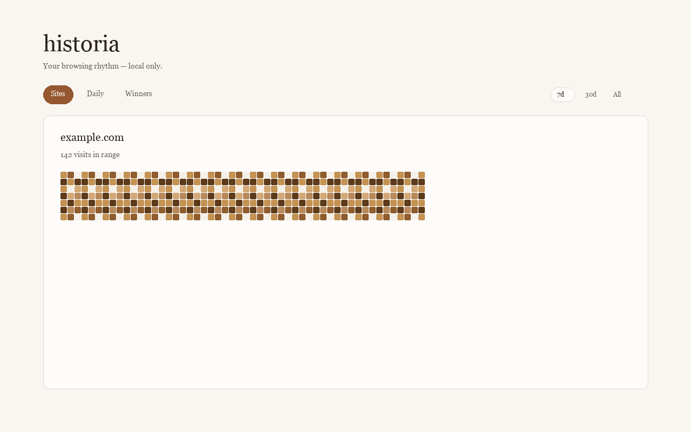
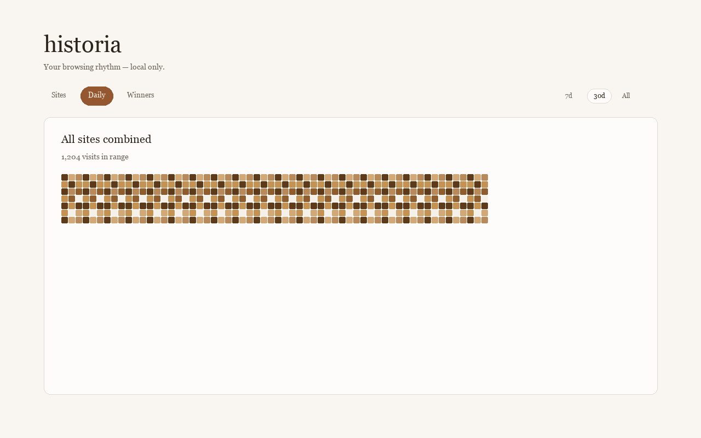
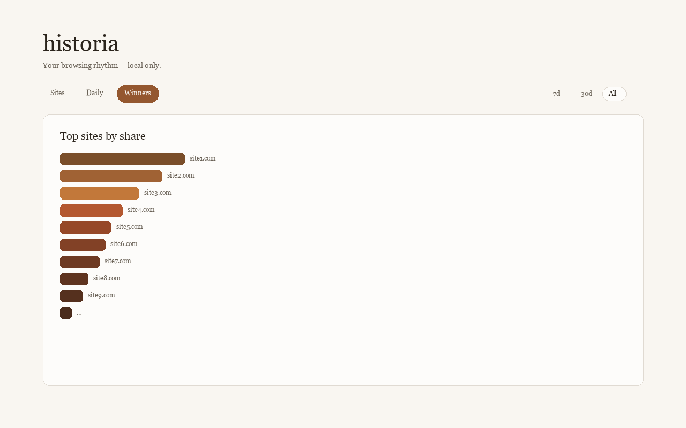

# historia

**Browser History Wrapped** — turn your local Chrome browsing history into warm activity heatmaps and per-site stats. Everything stays on your device.







## Install

### Chrome Web Store

The listing will be linked here **after Chrome Web Store review**. Check [Releases](https://github.com/abhi-j0407/historia/releases) for side-load installs in the meantime.

### Load unpacked (GitHub Release)

1. Open [GitHub Releases](https://github.com/abhi-j0407/historia/releases) and download `historia-0.1.0-chrome.zip` for the `v0.1.0` tag.
2. Extract the zip to a folder on your computer.
3. In Chrome, go to `chrome://extensions`.
4. Enable **Developer mode** (top right).
5. Click **Load unpacked** and select the extracted `chrome-mv3` folder (inside the zip).

## What it does

historia reads **local** `chrome.history`, aggregates visits by apex domain and day, and opens a full-page dashboard from the toolbar icon.

- **Sites** — heatmap and stats for one top site at a time.
- **Daily** — combined activity across all tracked sites.
- **Winners** — ranked share of attention in the selected date range (7d, 30d, or all).

Data is cached in `chrome.storage.local` so the dashboard opens quickly. Background updates run after you browse; you can also trigger a full refresh from the header.

## Privacy

Processing happens on your machine. The only network call is optional favicon loading for site chips (domain name sent to Google’s favicon service—no user ID). No accounts, analytics, or telemetry.

Full policy: [PRIVACY.md](./PRIVACY.md)

## Tech stack

- [WXT](https://wxt.dev/) (Manifest V3)
- React 18 + TypeScript
- Tailwind CSS v4 + [shadcn/ui](https://ui.shadcn.com/)
- Vitest + Testing Library

## Development

Requires **Node.js 22+** (see `.nvmrc`) and **pnpm 9+**.

```bash
pnpm install
pnpm dev      # WXT dev mode — loads extension in Chrome
pnpm build    # production build → .output/chrome-mv3/
pnpm zip      # CWS-ready zip → .output/historia-<version>-chrome.zip
pnpm test
pnpm lint
pnpm typecheck
```

To regenerate release icons and CWS images: `python3 -m pip install Pillow`, then `python3 scripts/generate-release-assets.py`.

## Project documents

- [PRD.md](./PRD.md) — product requirements (locked behavior)
- [PHASE-PLAN.md](./PHASE-PLAN.md) — implementation phases
- [DESIGN.md](./DESIGN.md) — visual identity (Phase 16)
- [PRODUCT.md](./PRODUCT.md) — product positioning

## License

[MIT](./LICENSE) — Copyright © 2026 Abhishek Jain
